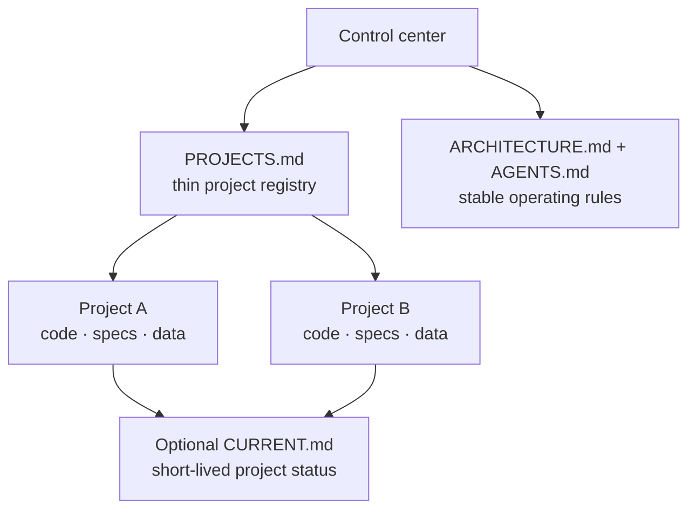

# Codex Project Control Center

> A privacy-first, file-based starter kit for organizing local Codex work.

[](https://github.com/Lai-Sheng/codex-project-control-center/actions/workflows/verify.yml)
[](LICENSE)

Codex Project Control Center gives you one small place to route active projects without turning every chat, note, or status update into permanent context. Each project keeps its own source of truth; the control center only records stable routing information.

## The one idea

> Projects do not need more memory. They need clear ownership.

When every project has a distinct home for its code, specifications, and current state, a control center only has one job: make that home easy to find. It should never become a second, stale copy of the project.

## What you get

- A neutral **control center** with a project registry and durable operating rules.
- A minimal **new-project template**.
- A bootstrap script for Windows PowerShell and macOS/Linux shells.
- Privacy and Git guidance designed for local-first work.

## Install

Clone this repository, then run the bootstrap script from its root.

### Windows PowerShell

```powershell
./scripts/bootstrap.ps1 -TargetPath "C:\path\to\your-control-center"
```

### macOS / Linux

```bash
./scripts/bootstrap.sh /path/to/your-control-center
```

The scripts copy only the neutral `templates/control-center` files. They refuse to overwrite existing files unless you explicitly opt in with `-Force` (PowerShell) or `--force` (shell).

## See it filled in first

Empty templates are hard to picture. The [fictional creative studio example](examples/fictional-creative-studio/) shows a control center with two active projects, each owning its own README, instructions, and optional short-lived state. Read it first; copy from `templates/` when you are ready.

## First use

1. Open the generated control-center folder in Codex.
2. Follow the [20-minute getting-started guide](docs/getting-started.md).
3. When a task deserves long-term ownership, create a separate project folder from `templates/project`.
4. Register only its stable name, root, and lifecycle in `PROJECTS.md`.

## The model



```text
Control center
  ├── routes to active projects
  ├── contains stable operating rules
  └── does not duplicate project state

Individual project
  ├── owns its code, data, specs, and README
  └── keeps temporary status only when genuinely useful
```

The control center is a router, not a second database. This keeps context discoverable while avoiding stale copies of project knowledge.

## Repository layout

```text
templates/
  control-center/     # Files copied into a user's control center
  project/            # Starting point for an independently owned project
scripts/              # Safe bootstrap scripts
docs/                 # Concepts and privacy guidance
```

## Scope

This project helps organize local Codex project context. It does not provide a cloud memory backend, retain chat transcripts, or manage secrets.

## Is this for you?

Use this if you have several long-lived local projects and want an agent to find the right project without loading the history of every other one. It is deliberately lightweight: if you only work in one repository at a time, a well-written project README may be all you need.

## Quality bar

The bootstrap flow is checked on Windows PowerShell and Ubuntu by GitHub Actions. Changes to the installer should keep both paths working and update their tests.

## Roadmap

- [x] Neutral control-center and project templates.
- [x] Windows and POSIX-shell bootstrap scripts.
- [x] Cross-platform CI for the bootstrap flow.
- [x] A fully fictional example control center for people who learn by copying a complete example.
- [ ] Optional guided project-creation command.

## Safety and privacy

Do not commit credentials, personal paths, private data, or transient personal status. Read [the privacy guide](docs/privacy.md) before publishing a control center or project repository.

## Contributing

Contributions are welcome. Please read [CONTRIBUTING.md](CONTRIBUTING.md), [CODE_OF_CONDUCT.md](CODE_OF_CONDUCT.md), and [SECURITY.md](SECURITY.md).

## License

Released under the [MIT License](LICENSE).
